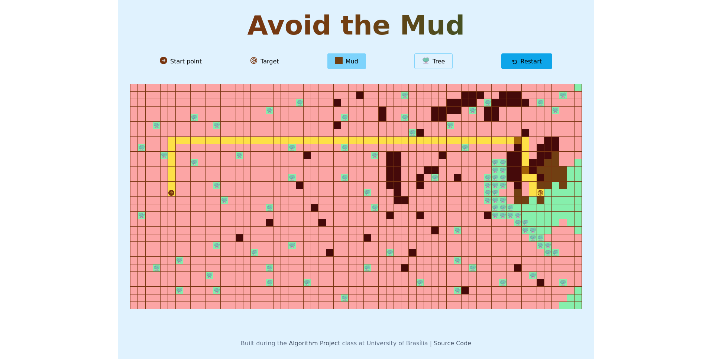
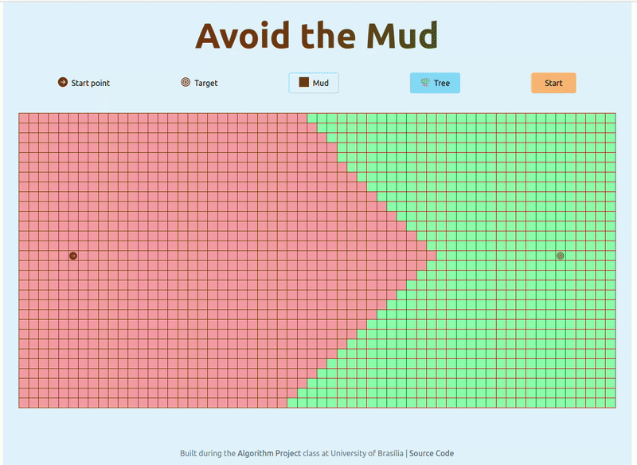
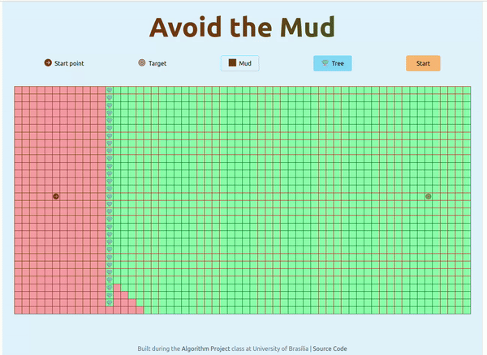
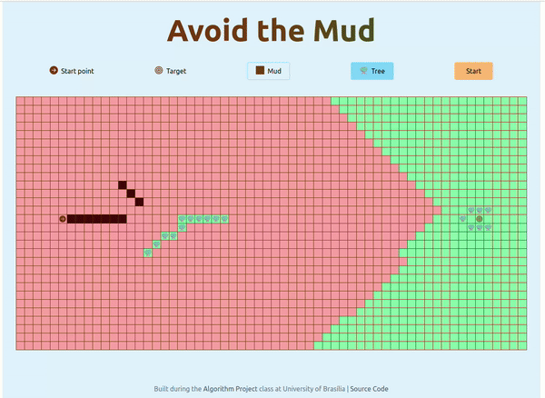

# Grafos 2 -> AvoidTheMud




**Número da Lista**: 2<br>
**Conteúdo da Disciplina**: Grafos 2<br>

## Alunos
|Matrícula | Aluno |
| -- | -- |
| 19/0108011  |  Guilherme Brito Vilas - Bôas |
| 19/0102390  |  André Macedo Rodrigues Alves |

## Sobre 
Esse projeto tem por objetivo a implementação de um simples jogo de labirinto para fortalecer os conhecimentos nos conteúdos aprendidos no módulo de Grafos 2, especialmente o Algoritmo de Dijkstra.
Nos baseamos em um grid, no qual cada nó é representado por um quadrado no labirinto e inicialmente todos os nós estão conectados caso sejam vizinhos em pontos cardeais (Norte, Sul, Leste, Oeste). O Usuário tem opção de adicionar árvores, logo, as conexões iniciais são quebradas ou adicionar um território de lama (aumenta o custo de se passar por aquela aresta). O Algoritmo mostra no final da execução o caminho de menor custo do ponto de origem ao ponto de chegada baseado no algoritmo citado acima.


## Screenshots

### Mapa sem barreiras e sem lama


### Mapa com Barreiras


### Mapa com Barreiras e Lama


## Instalação 
**Linguagem**: JavaScripts<br>
**Framework**: React Framework<br>
Certifique-se de ter o NodeJs (versão >= 18.0.0) instalado em sua máquina e rode os seguintes comandos em seu terminal:
```npm install```

## Uso 
A maneira mais fácil de utilizar o app é visitando o [link do github pages](https://projeto-de-algoritmos.github.io/Grafos2_AvoidTheMud) em que o projeto está hospedado.
Após isso, o usuário pode:
- Adicionar 'Mud'(Lama): Clicar em Mud e selecionar os quadrados que deseja adicionar lama.
- Adicionar 'Tree'(Árvore): Clicar em Tree e selecionar os quadrados que deseja adicionar uma barreira.

Após isso, o usuário deve clicar em 'Start' e o algoritmo de Djikstra entrará em ação, ao final, o usuário terá o menor caminho entre o Start Point e o Target.
